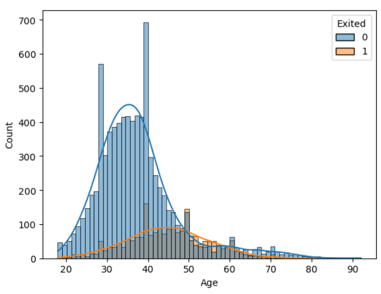

# 🏦 Bank Customer Data Preparation & Exploration  
##  A Data Science Case Study | Customer Churn & Segmentation Project

## 🎯 Overview
This project showcases my work preparing and exploring customer data for a national banking institution. The goal was to transform raw operational data into a clean, validated, and insights-ready dataset to support two machine learning initiatives:

- **Customer Churn Prediction**
- **Customer Segmentation**

I led the full data preparation workflow, including data integration, quality assurance, cleaning, exploratory analysis, and feature preparation for modeling.

---

## 🌍 Context & Business Problem
The **Bank of Mavenland**—a large financial institution in a data-centric region—was experiencing:

-  An increase in customer churn  
-  A slowdown in customer acquisition  
-  A lack of clarity around the drivers of these trends  

The product team sought a deeper understanding of customer behavior and needed data prepared for advanced analytics. I was hired as a Data Scientist to build the foundation for two high-impact machine learning projects.

---

## 🧩 Project Challenges
The bank’s customer data existed across several disconnected sources, each with different formats, inconsistencies, and quality issues. Before any modeling could begin, the data needed to be:

-  Joined accurately  
-  Cleaned thoroughly  
-  Audited for quality  
-  Explored for meaningful patterns  

---

## 👨‍💻 My Role
I was responsible for transforming the raw data into an analysis-ready asset and uncovering early insights that could guide both the product team and future modeling work.

My responsibilities included:

-  Data integration  
-  Data cleaning & standardization  
-  Exploratory Data Analysis (EDA)  
-  Feature engineering  
-  Preparing inputs for machine learning pipelines  

---

## 🎯 Project Objectives & Deliverables

### 1️⃣ Import, Join & QA the Data  
**Objective:** Consolidate customer and account information from multiple Excel sheets into a single, reliable dataset.

**What I did:**

- Imported two sheets from the `Bank_Churn_Messy.xlsx` file:
  - Customer information  
  - Account information  
- Performed a **left join** on `CustomerId` to keep all customers and bring in their account details.  
- Removed duplicate records after the merge.  
- Validated the join by checking shapes, types, and summaries of the resulting dataset.

**Key Deliverable:** A unified, de-duplicated customer–account dataset ready for cleaning and analysis.

---

### 2️⃣ Clean & Standardize the Data  
**Objective:** Ensure the dataset is accurate, consistent, and suitable for downstream analysis and modeling.

**What I did:**

- Cleaned currency fields (`EstimatedSalary`, `Balance`) by:
  - Removing the `€` symbol  
  - Converting values to numeric types (`float`)  

- Resolved duplicated tenure columns produced during the merge:
  - Dropped `Tenure_y`  
  - Renamed `Tenure_x` → `Tenure`  

- Standardized categorical values in `Geography`  
  (e.g. grouping variants such as `France`, `French`, `FRA` under a single `"France"` label).

- Handled missing values by:
  - Filling missing `Surname` with `"MISSING"`  
  - Imputing missing `Age` with the median age  

**Key Deliverable:** A clean, standardized dataset with consistent fields, ready for EDA.

---

### 3️⃣ Explore Feature Relationships with Customer Churn  
**Objective:** Understand how different customer attributes relate to churn and identify potentially predictive features.

I used a variety of visualizations to explore relationships between features and the churn label (`Exited`).

---

## 📊 Exploratory Data Analysis (EDA)

### 3.1 Overall Churn Distribution

### Insight
The dataset shows a clear class imbalance, requiring careful modeling consideration such as resampling or weighting.

### 🌍 3.2 Churn by Geography

 
 
### Insight
Churn behavior varies noticeably across regions, revealing potential opportunities for targeted retention strategies.

### 👥 3.3 Churn by Gender & Other Categorical Variables

 
### Insight
Gender shows slight churn variation, but other categorical features highlight stronger differences in customer behavior.

### 📦 3.4 Boxplots of Numerical Features vs Churn

 
### Insight
Numerical features such as Age, Balance, and Tenure show meaningful separation between churners and non-churners.

### 📈 3.5 Distribution of Key Variables (Histograms)

 
### Insight
Histograms highlight skewness and distribution differences, which inform feature transformations and modeling assumptions.

## 🧠 4️⃣ Feature Engineering & Modeling Preparation

### 4.1 Engineered Feature: Balance-to-Income Ratio

### Insight
The balance_v_income ratio revealed clear differences between churners and non-churners, making it a strong predictive feature.

### 4.2 Modeling Dataset Preparation

Deliverable:
A fully cleaned, encoded modeling_df suitable for churn modeling and clustering.

### 📈 Key Insights

Churn differs significantly across regions, making geography a strong segmentation variable

Tenure, Age, and Balance are strong indicators of churn likelihood

The engineered balance_v_income feature adds meaningful predictive value

The dataset’s class imbalance must be addressed before modeling
